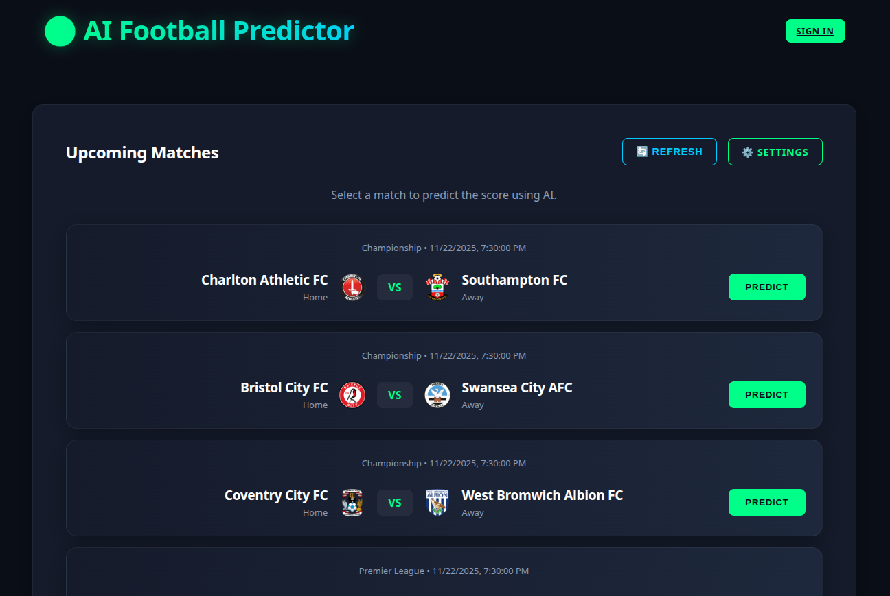

# ⚽ AI Football Predictor

A modern, AI-powered web application that predicts football match scores using advanced Large Language Models (LLMs). Built with React and Vite, this app combines real-time match data with the analytical power of AI to provide score predictions and insights.



## ✨ Features

*   **🤖 AI-Powered Predictions**: Predict match scores using your preferred AI provider:
    *   **Google Gemini** (Pro, Flash, etc.)
    *   **OpenAI** (GPT-4, GPT-3.5)
    *   **OpenRouter** (Claude 3, Mistral, Llama 3, etc.)
    *   **Cloudeka** (DekaLLM)
    *   **OpenAI-compatible endpoints** (like [Cloudeka DekaLLM](https://www.cloudeka.id), Local LLMs, LM Studio or Ollama)
*   **📅 Real-Time Match Data**: Fetches up-to-date schedules and results from [Football-Data.org](https://www.football-data.org/).
*   **🌍 Multi-Language Support**: Fully localized interface in **English** and **Bahasa Indonesia**.
*   **📱 Mobile-First Design**: A responsive, sleek UI that looks great on smartphones and desktops.
*   **🔒 Privacy-Focused**: API keys are stored locally in your browser's `localStorage` and are never sent to our servers.
*   **⚙️ Customizable**: Configure your preferred AI model, base URL, and language in the Settings.

## 🛠️ Tech Stack

*   **Frontend**: React 19, Vite
*   **Styling**: Vanilla CSS (Responsive, Dark Mode)
*   **Routing**: React Router DOM
*   **APIs**:
    *   Football-Data.org (Match Data)
    *   Google Gemini API
    *   OpenAI API / OpenRouter
    *   Cloudeka (DekaLLM) or OpenAI-compatible endpoints

## 🚀 Getting Started

### Prerequisites

*   Node.js (v16 or higher)
*   npm or yarn

### Installation

1.  **Clone the repository**
    ```bash
    git clone https://github.com/febyferdinan/ai-football-predictor.git
    cd ai-football-predictor
    ```

2.  **Install dependencies**
    ```bash
    npm install
    ```

3.  **Start the development server**
    ```bash
    npm run dev
    ```

4.  Open your browser and navigate to `http://localhost:5173`.

## ⚙️ Configuration

To use the app, you need to configure your API keys in the **Settings** page:

1.  **Football Data API Key**:
    *   Sign up for a free API key at [football-data.org](https://www.football-data.org/).
    *   Enter the key in the "Football Data API Key" field.

2.  **AI Provider**:
    *   Select your preferred provider (Gemini, OpenAI, OpenRouter, Cloudeka or OpenAI-compatible).
    *   Enter the corresponding **API Key**.
    *   Specify a **Model Name** (e.g., `gemini-2.5-flash`, `gpt-4o`, `anthropic/claude-3-haiku`).
    *   (Optional) For Cloudeka, Local LLMs and OpenAI Compatible, set the **Base URL** (e.g., `https://dekallm.cloudeka.ai/v1` or `http://localhost:1234/v1`).

## 📦 Deployment

This project is optimized for deployment on **Vercel**.

1.  Push your code to a GitHub repository.
2.  Import the project into Vercel.
3.  Vercel will automatically detect the Vite settings.
4.  **Important**: The `vercel.json` file included in this repo handles the API proxying required to avoid CORS issues with the Football Data API.

## 📄 License

This project is open-source and available under the [MIT License](LICENSE).
